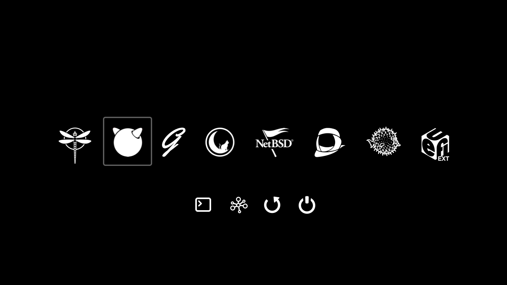

# rEFInd BSD Black

A mash-up of various black rEFInd themes to include the BSD OS icons and nicer version of the tools icons.

If anything is missing let me know where to find it or submit a PR.

## Installation

Clone this repository

`git clone https://github.com/indgy/refind-bsd-black`

Mount your existing EFI partition (assuming it's at on ada0 at partition 1)

`mount -t msdosfs /dev/ada0p1 /mnt`

Copy the refind-bsd-theme folder to your efi partition

`cp ./refind-bsd-black /mnt/efi`

Edit your `refind.conf` to reference the theme (assuming your refind folder is named `boot`)

`edit /mnt/efi/boot/refind.conf`

#### Attributions:

DragonFlyBSD https://www.dragonflybsd.org/images/
FreeBSD http://seeklogo.com/freebsd-logo-273101.html
GhostBSD https://github.com/ghostbsd/ghostbsd-logo
MidnightBSD https://www.midnightbsd.org/art/
NetBSD https://netbsd.org/gallery/logos.html
NomadBSD https://github.com/nomadbsd/artwork
OpenBSD https://www.shareicon.net/openbsd-102884
Haiku butchered from https://commons.wikimedia.org/wiki/File:Haiku_(operating_system)_logo.svg

Refind theme based on
https://github.com/anthon38/refind-black
https://github.com/evanpurkhiser/rEFInd-minimal